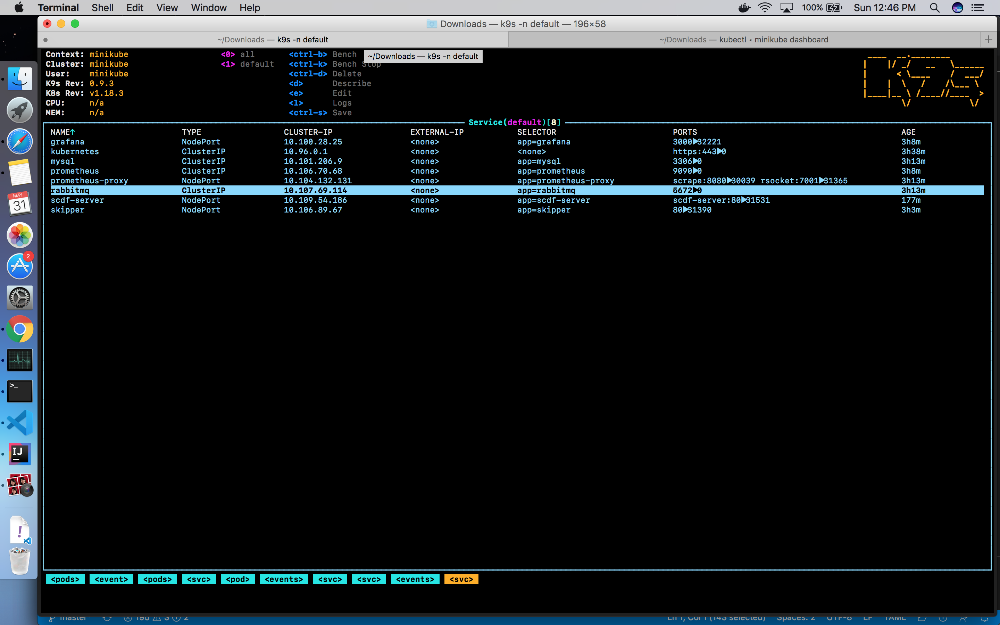
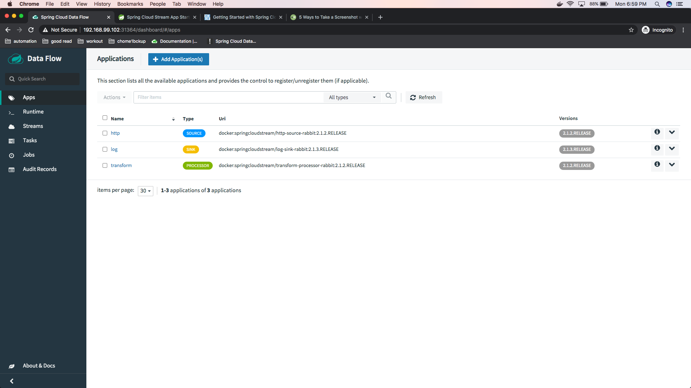
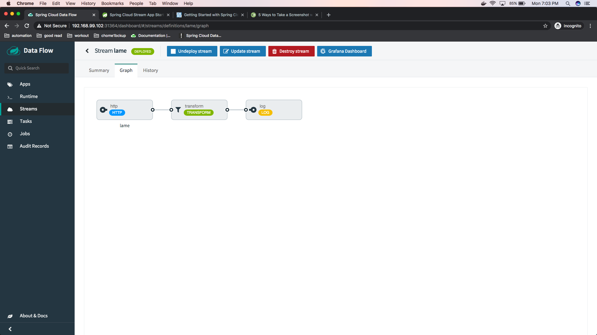
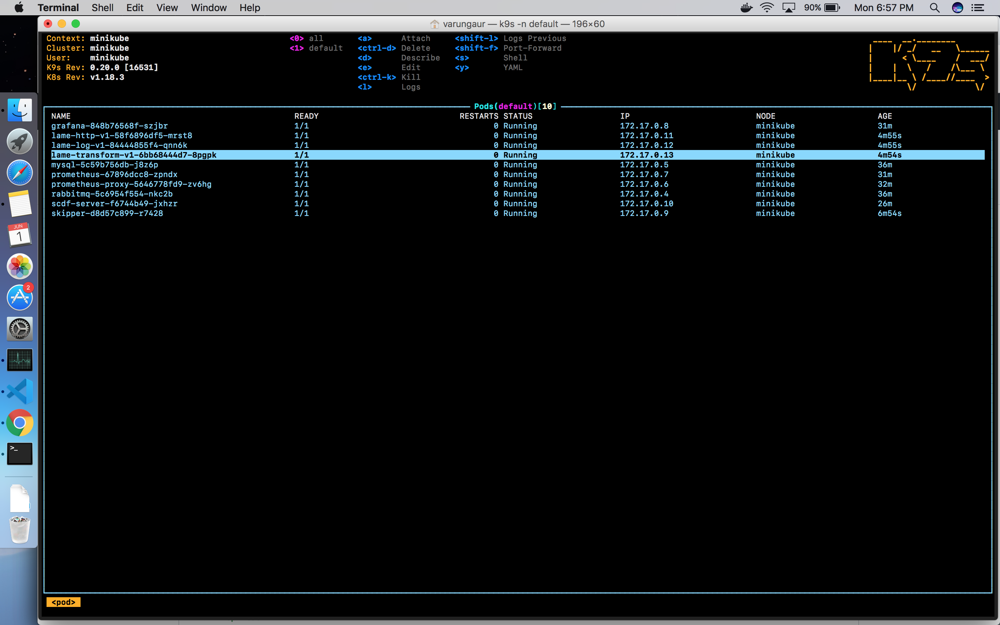
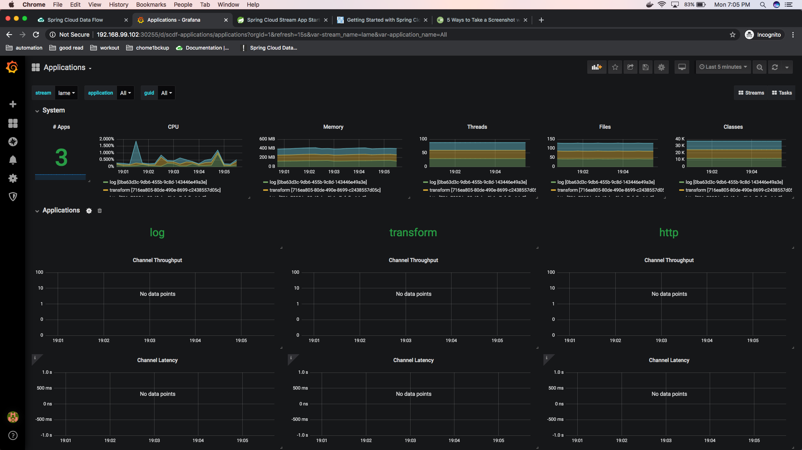
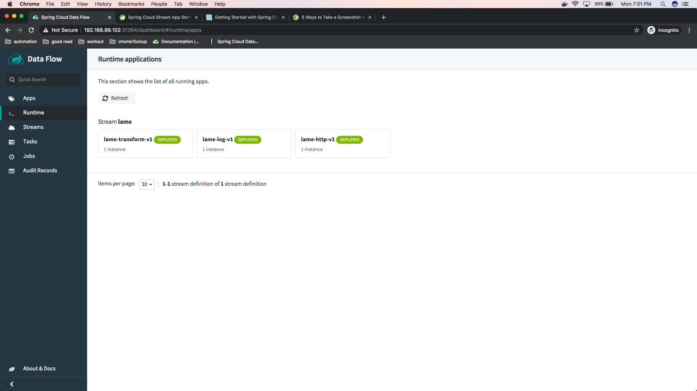
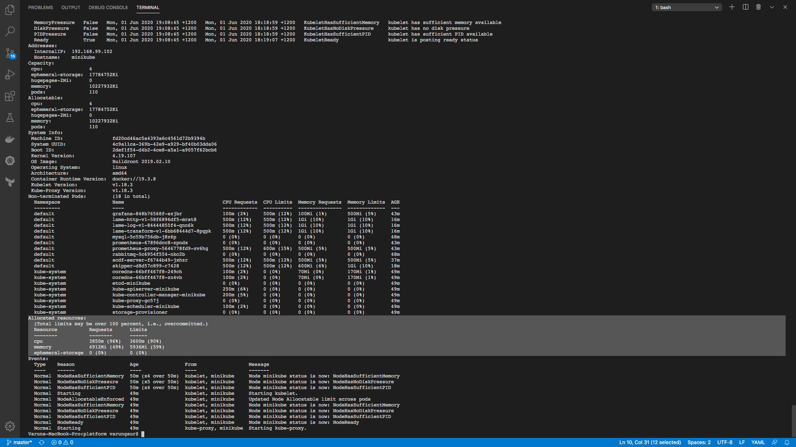
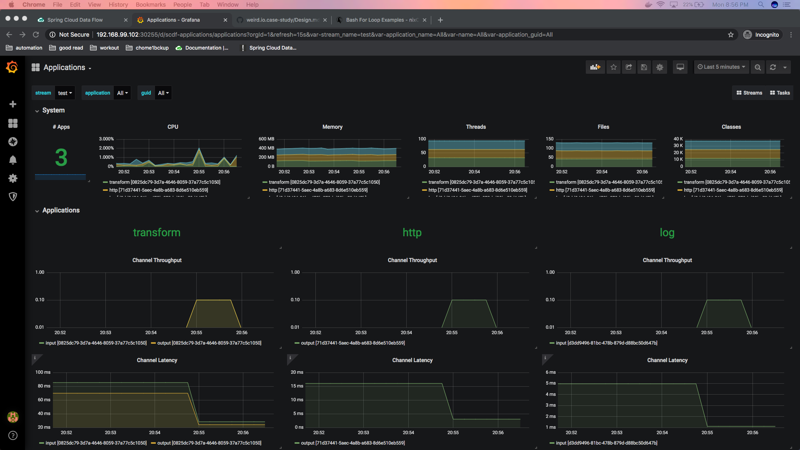
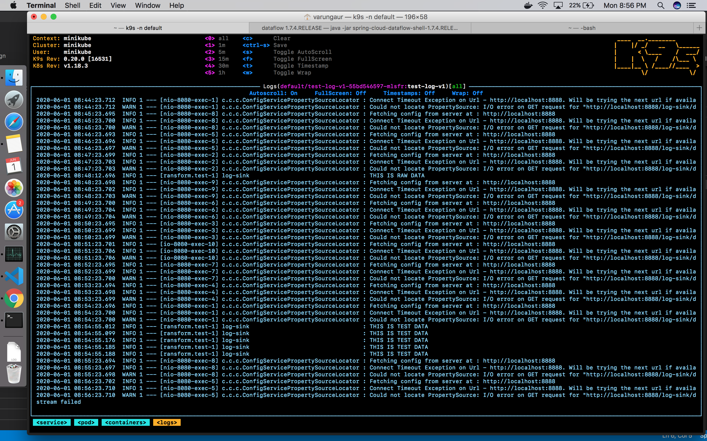

Stream Processing Components

# Architecture Components

- Spring Data Flow Server 
    * Parses, Validates and Persist streams
    * Delegates deployments of stream to skipper
    * Registers source, transfomer and sink applications
- Spring Skipper Server
    * Manages streams deployment, upgrades and rolling back(
    In case of kubernetes as runtime platform. Deploys stream as pods)
- MySQL Database
    * Used by both the servers to store the state info about application registered, stream definition. 
- Message Broker Middleware(Rabbit MQ)
    * To send and receive the stream data/messages

## Additional compoments for Stream Monitoring 
- Prometheus 
    * Pull based time series data base to aggregate time series data in realtime
- Grafana
    * Visualize the TSD

# Infrastructure

This section provides a summary of run time platform for spring cloud data flow.

- Target Runtime environment: 
    * Kubernetes (minikube cluster locally)
    * Local

_Dashboard.png)

# Application

Source (http) -> Transform -> Sink(log)

## SOURCE MICROSERVICE  
Springboot application that uses reactive stream java DSL to poll the data from finnhub.io (https://finnhub.io/api/v1/quote?symbol=AAPL&token=) with a fixed interval of 1 sec and routes it to Source.OUTPUT

## PROCESSOR MICROSERVICE  
Springboot application that uses reactive stream java DSL to receive data from INBOUND channel and transforms it before putting it on to the OUTBOUND Channel.

## SINK MICROSERVICE
Springboot application that uses the reactive stram java DSL to receive the transformed data putting it into JDBC sink. The reason for choosing the JDBC sink is because the requirement is more kind of fits into db queryable format example `Select rates from quotes where timestamp between <> and <>`

